# SBOM Validator – Features

## Overview

| Category | Feature | Description |
|---|---|---|
| Input types | Upload SBOM File | User can upload an SBOM file in JSON format. Supported versions are:<br>• CycloneDX – v1.4<br>• SPDX – v2.3<br>• CDQ SPDX – v2.3<br>• CDQ CycloneDX – v1.6<br>• Custom Schema |
| Operations | Validate | Validate the uploaded SBOM against the corresponding schema. If no errors are found, the BOM is valid. Otherwise, the file is not valid and the errors or missing properties are displayed. |
|            | Edit & Download | User can edit and download the SBOM in JSON/YAML format. |
|            | Merge | Merge multiple valid SBOM files of the same schema type. |

---

## How to Use

### 1. Upload SBOM File through the User Interface

Users can upload an SBOM file in JSON format. Supported schema type versions are:-

- CycloneDX – v1.4
- SPDX – v2.3
- CDQ SPDX – v2.3
- CDQ CycloneDX – v1.6
- Custom Schema

Click the **Validate** button after uploading the file. The uploaded SBOM is validated against the corresponding schema. If no errors are found, the BOM is valid. Otherwise, the file is not valid and the errors or missing properties are displayed.

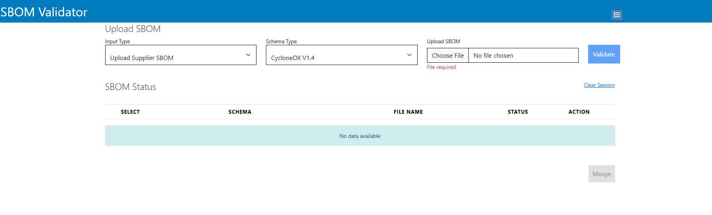

The validated result is displayed under the **SBOM status**.

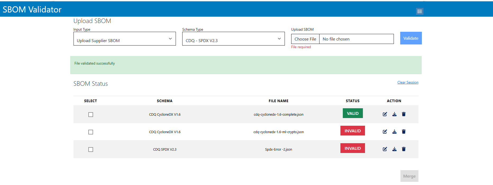

Users can click the **Edit** option under **Actions** to view and edit the uploaded SBOM.

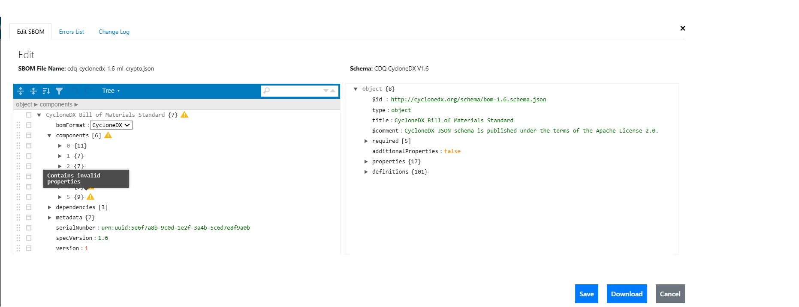

View the error message details in the **Error List** tab.

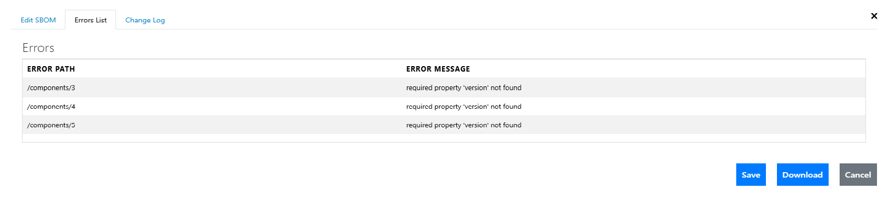

Any changes made by the user can be viewed in the **ChangeLog** tab.

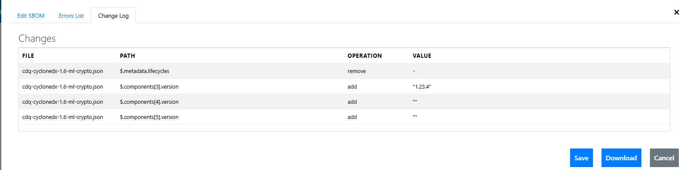

---

### 2. Upload & Validate SBOM File via `curl`

```bash
curl --noproxy localhost \
     --location "API_PATH" \
     --form "postData={\"schemaType\":\"SELECT_SchemaType\",\"sessionId\":\"USERID\"}" \
     --form "file=@SBOM_File_Path"
```

#### Parameters

- **`API_PATH`** – Backend service hosted location.

- **`SELECT_SchemaType`** – Indicates the uploaded file schema type:

  | Value | Schema |
  |---|---|
  | `cdqcydx` | CDQ CycloneDX v1.6 |
  | `cyclonedx` | CycloneDX v1.4 |
  | `spdx` | SPDX v2.3 |
  | `cdqspdx2.3` | CDQ SPDX v2.3 |

- **`USER_NTID`** – User session identifier.

- **`SBOM_File_Path`** – Path to the SBOM file to be uploaded.

---

#### Example
```bash
curl --noproxy localhost \
     --location "http://localhost:9053/uploadAndValidate\" \
     --form "postData={\"schemaType\":\"cdqcydx",\"sessionId\":\"TEE123\"}" \
     --form "file=@C:\Users\CDQ0302\CYDX-1.6\CycloneDX-Valid-1.json"
```

#### Example for generating log details in to a file
```bash
curl --noproxy localhost \
     --location "http://localhost:9053/uploadAndValidate\" \
     --form "postData={\"schemaType\":\"cdqcydx",\"sessionId\":\"TEE123\"}" \
     --form "file=@C:\Users\CDQ0302\CYDX-1.6\CycloneDX-Valid-1.json" -o "C:\Users\CDQ0302\SPDX-2.3\edited-Spdx-Valid-1_log.txt"
```

###  Upload & Validate SBOM File using Custom Schema via `curl`

```bash
curl --noproxy localhost \
     --location "API_PATH" \
     --form "postData={\"schemaType\":\"custom\",\"sessionId\":\"USER_NTID\"}" \
     --form "file=@SBOM_File_Path" --form "schemaFile=@Schema_File_Path"
```

#### Parameters

- **`API_PATH`** – Backend service hosted location.
  Example:
  - `http://localhost:9053/customValidate`

- **`schemaType`** – Indicates the uploaded file schema type:

  | Value | Schema |
  |---|---|
  | `custom` | Custom Schema |


- **`USER_NTID`** – User session identifier.

- **`SBOM_File_Path`** – Path to the SBOM file to be uploaded.

- **`Schema_File_Path`** – Path to the Custom Schema file to be uploaded.

---
#### Example

```bash
curl --noproxy localhost \
     --location "http://localhost:9053/customValidate\" \
     --form "postData={\"schemaType\":\"custom",\"sessionId\":\"TEE123\"}" \
     --form "file=@C:\Users\CDQ0302\CYDX-1.6\CycloneDX-Valid-1.json" --form "schemaFile=@C:\Users\CDQ0302\CYDX-1.6\CycloneDX_Schema.json"
```

#### Example for generating log details in to a file
```bash
curl --noproxy localhost \
     --location "http://localhost:9053/customValidate\" \
     --form "postData={\"schemaType\":\"custom",\"sessionId\":\"TEE123\"}" \
     --form "file=@C:\Users\CDQ0302\CYDX-1.6\CycloneDX-Valid-1.json" --form "schemaFile=@C:\Users\CDQ0302\CYDX-1.6\CycloneDX_Schema.json" -o "C:\Users\CDQ0302\SPDX-2.3\edited-CycloneDX_log.txt"
```
---

### 3. Merge SBOMs

Users can merge valid SBOMs of the same schema type.

1. Select multiple SBOMs from the **SBOM status** list and click the **Merge** button.

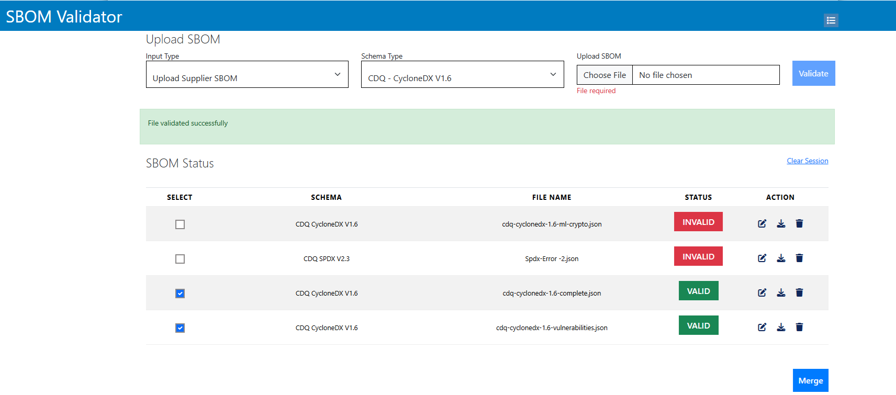

2. Fill in the root-level metadata component information and submit.

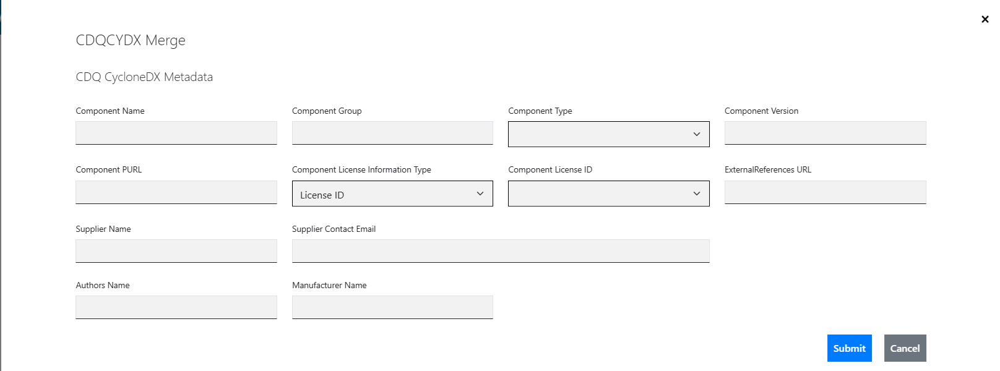

3. The merged result is displayed.

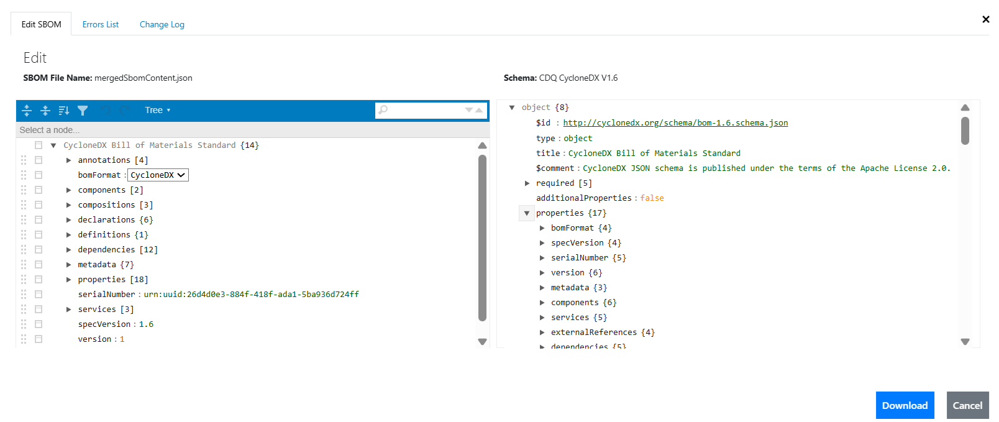

#### CDQ – CycloneDX 1.6 Merge

The user provides input component data, and the merged CycloneDX 1.6 SBOM is generated accordingly.

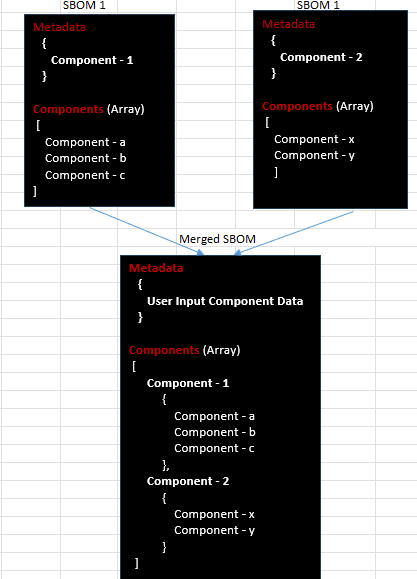

#### CDQ – SPDX 2.3 Merge

The user provides input component data. The user-input package SPDX ID establishes the `contains` relationship between each package in the input files.

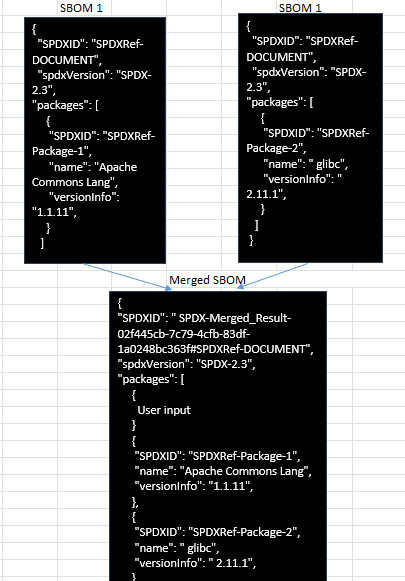

The user-input package SPDX ID establishes the `contains` relationship between each package in the input files.

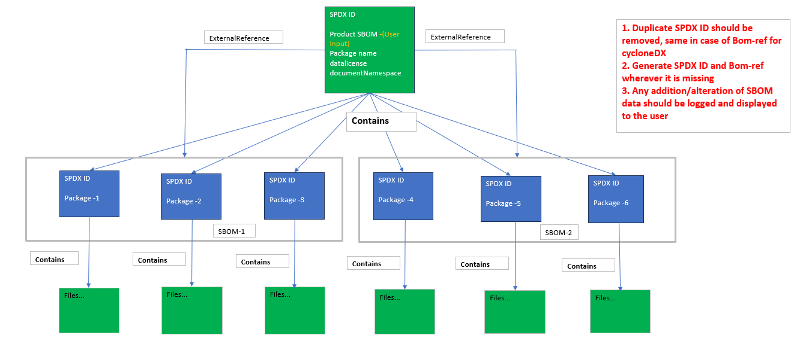
---

### 2. Merge SBOM Files via `curl`

```bash
curl --noproxy localhost \
     --location "API_PATH" \
     --form "postData={\"schemaType\":\"SELECT_SchemaType\",\"sessionId\":\"USERID\"}" \
     --form "file=@SBOM_File_Path" --form "manifestFile=@ManifestFile_Path"
```

#### Parameters

- **`API_PATH`** – Backend service hosted location (http://localhost:9053/validateAndMerge).

- **`SELECT_SchemaType`** – Indicates the uploaded file schema type:

  | Value | Schema |
  |---|---|
  | `cdqcydx` | CDQ CycloneDX v1.6 |
  | `cyclonedx` | CycloneDX v1.4 |
  | `spdx` | SPDX v2.3 |
  | `cdqspdx2.3` | CDQ SPDX v2.3 |

- **`USERID`** – User session identifier.

- **`SBOM_File_Path`** – Path to the SBOM files to be merged.

- **`ManifestFile_Path`** – Path to the SBOM Manifest file(Information of merged SBOM metadata).

# ManifestFile Documentation

| # | Schema Type   | Reference File        |
|---|---------------|-----------------------|
| 1 | cdqcydx       | CycloneDX1.6.json     |
| 2 | cyclonedx     | CycloneDX1.4.json     |
| 3 | spdx          | Spdx2.3.json          |
| 4 | cdqspdx2.3    | CDQ_Spdx2.3.json      |

---

## Sample JSON Content

### 1. cdqcydx (CycloneDX1.6.json)

```json
{
  "metadata": {
    "authors": [
      {
        "name": "author"
      }
    ],
    "manufacturer": {
      "name": "manufaturer"
    },
    "component": {
      "licenses": [
        {
          "license": {
            "id": "0BSD"
          }
        }
      ],
      "externalReferences": [
        {
          "type": "other",
          "url": "url"
        }
      ],
      "name": "component",
      "group": "Apps",
      "type": "cryptographic-asset",
      "version": "v32",
      "purl": "purl"
    },
    "supplier": {
      "contact": [
        {
          "email": "test@example.com"
        }
      ],
      "name": "supplier"
    }
  }
}
```

---

### 2. cyclonedx (CycloneDX1.4.json)

```json
{
  "metadata": {
    "component": {
      "licenses": [
        {
          "license": {
            "id": "MIT"
          }
        }
      ],
      "name": "Merge_test",
      "group": "acme.apps",
      "type": "container",
      "version": "v32"
    },
    "supplier": {
      "contact": [
        {
          "email": "supplier@test.com"
        }
      ],
      "name": "supplier"
    }
  }
}
```

---

### 3. spdx (Spdx2.3.json)

```json
{
  "creationInfo": {
    "creators": [
      "Tool: BOM Validator",
      "Organization:Organization_name",
      "Person:Person_name"
    ]
  },
  "packages": [
    {
      "externalRefs": [
        {
          "comment": "NOASSERTION",
          "referenceCategory": "OTHER",
          "referenceLocator": "NOASSERTION",
          "referenceType": "NOASSERTION"
        }
      ],
      "name": "zlib",
      "versionInfo": "v1.4.3",
      "primaryPackagePurpose": "SOURCE",
      "licenseDeclared": "MIT",
      "copyrightText": "NOASSERTION"
    }
  ]
}
```

---

### 4. cdqspdx2.3 (CDQ_Spdx2.3.json)

```json
{
  "creationInfo": {
    "creators": [
      "Tool: BOM Validator",
      "Organization:Test_Organization",
      "Person:Test"
    ]
  },
  "packages": [
    {
      "externalRefs": [
        {
          "referenceCategory": "OTHER"
        }
      ],
      "name": "zlib",
      "versionInfo": "v2.3.4",
      "primaryPackagePurpose": "APPLICATION",
      "licenseConcluded": "MIT"
    }
  ]
}
```
---

#### Example
```bash
curl --noproxy localhost \
     --location "http://localhost:9053/validateAndMerge\" \
     --form "postData={\"schemaType\":\"cdqcydx",\"sessionId\":\"TEE123\"}" \
     --form "file=@C:\Users\CDQ0302\CYDX-1.6\CycloneDX-Valid-1.json,C:\Users\CDQ0302\CYDX-1.6\CycloneDX-Valid-2.json,C:\Users\CDQ0302\CYDX-1.6\CycloneDX-Valid-3.json"
     --form "manifestFile=@C:\Users\CDQ0302\Manifest_Files\CycloneDX1.6.json"
```

---
### 2. Upload & Validate SBOM File via `PowerShell Command`

The user can download the sbom-tools.ps1(Powershell script) file from the repositories.

Open PowerShell
```bash
. sbom-tools.ps1_File_Path\sbom-tools.ps1 (For loading the sbom-tools.ps1)
```
#### Parameters

- **`sbom-tools.ps1_File_Path`** – Path to the sbom-tools.ps1(Powershell Script).

---
### Upload & Validate SBOM File command

```bash
uploadAndValidate <SBOM_File_Path> <SELECT_SchemaType>
```

#### Parameters 

- **`SBOM_File_Path`** – Path to the SBOM file to be uploaded.

- **`SELECT_SchemaType`** – Indicates the uploaded file schema type:

  | Value | Schema |
  |---|---|
  | `cdqcydx` | CDQ CycloneDX v1.6 |
  | `cyclonedx` | CycloneDX v1.4 |
  | `spdx` | SPDX v2.3 |
  | `cdqspdx2.3` | CDQ SPDX v2.3 |

---

#### Example
```bash
uploadAndValidate C:\Users\CDQ0302\SPDX-2.3\edited-Spdx-Valid-1.json cdqspdx2.3
uploadAndValidate C:\Users\CDQ0302\CYDX-1.6\CycloneDX-Valid-1.json cdqcydx
```

#### Example for generating log details in to a file
```bash
uploadAndValidate C:\Users\CDQ0302\SPDX-2.3\edited-Spdx-Valid-1.json cdqspdx2.3 -o C:\Users\CDQ0302\SPDX-2.3\edited-Spdx-Valid-1_log.txt

uploadAndValidate C:\Users\CDQ0302\CYDX-1.6\CycloneDX-Valid-1.json cdqcydx -o C:\Users\CDQ0302\SPDX-2.3\CycloneDX-Valid-1_log.txt
```
---

### Upload & Validate SBOM File using Custom Schema
```bash
customValidate <SBOM_File_Path> <Schema_File_Path>
```
#### Parameters 

- **`SBOM_File_Path`** – Path to the SBOM file to be uploaded.
- **`Schema_File_Path`** – Path to the Schema file to be uploaded.

#### Example
```bash
customValidate C:\test-data\A1bom.json C:\test-data\schema.json
```

#### Example for generating log details in to a file
```bash
customValidate C:\test-data\A1bom.json C:\test-data\schema.json -o C:\test-data\response.txt
```
---

## Running the Application with Docker

The application is packaged as two Docker services: a backend API and a public UI. Both services are defined in `compose.yaml` and can be started together using Docker Compose.

### Services

| Service           | Image                          | Host Port | Container Port | Description                |
|-------------------|--------------------------------|-----------|----------------|----------------------------|
| sbom-backend      | mmq1cob737/sbom-backend        | 9053      | 9053           | Backend API service        |
| sbom-public-ui    | mmq1cob737/sbom-public-ui      | 8080      | 80             | Public-facing web UI       |

### compose.yaml

```yaml
services:
  sbom-backend:
    image: mmq1cob737/sbom-backend
    ports:
      - "9053:9053"   # Adjust as needed

  sbom-public-ui:
    image: mmq1cob737/sbom-public-ui
    ports:
      - "8080:80"   # Adjust as needed
```

### Prerequisites

- Docker Engine installed and running
- Docker Compose v2 (`docker compose` CLI)

### Steps to Run

1. Navigate to the directory containing `compose.yaml`:

   ```bash
   cd C:\Users\Docker
   ```

2. Pull the latest images:

   ```bash
   docker compose pull
   ```

3. Start the services in detached mode:

   ```bash
   docker compose up -d
   ```

4. Verify the running containers:

   ```bash
   docker compose ps
   ```

### Access URLs

| Component        | URL                       |
|------------------|---------------------------|
| Public UI        | http://localhost:8080/sbom-utils-ui/#/     |
| Backend API      | http://localhost:9053     |

### Stopping the Application

To stop and remove the containers:

```bash
docker compose down
```
---

# CDQ Schema description
 
 This table refers the mandatory parameters from CycloneDX 1.6 and SPDX 2.3 as per the CDQ Schema.


<table border="1" class="dataframe">
  <thead>
    <tr style="text-align: right;">
      <th>Sl No</th>
      <th>Object</th>
      <th>CycloneDX 1.6</th>
      <th>Description</th>
      <th>Remarks</th>
      <th>SPDX 2.3</th>
      <th>Description</th>
      <th>Remarks</th>
      <th></th>
    </tr>
  </thead>
  <tbody>
    <tr>
      <td>1.0</td>
      <td>The software itself(Meta data)</td>
      <td>metadata.component.name</td>
      <td>The name of the component. This will often be a shortened, single name of the component.</td>
      <td></td>
      <td>Package:name</td>
      <td>Identify name of this SpdxElement.</td>
      <td></td>
      <td></td>
    </tr>
    <tr>
      <td></td>
      <td></td>
      <td>metadata.component.group</td>
      <td>The grouping name or identifier.</td>
      <td></td>
      <td></td>
      <td></td>
      <td>In SPDX no equalent parameter available for mapping metadata.component.group</td>
      <td></td>
    </tr>
    <tr>
      <td></td>
      <td></td>
      <td>metadata.component.type</td>
      <td>Specifies the type of component.</td>
      <td></td>
      <td>packages.PrimaryPackagePurpose</td>
      <td>This field provides information about the primary purpose of the identified package.</td>
      <td>As per RFC-0054-02</td>
      <td></td>
    </tr>
    <tr>
      <td></td>
      <td></td>
      <td>metadata.component.version</td>
      <td>The component version.</td>
      <td></td>
      <td>packages.versionInfo</td>
      <td>Identify the version of the package.</td>
      <td></td>
      <td></td>
    </tr>
    <tr>
      <td></td>
      <td></td>
      <td>metadata.component.licenses.license.id                             or metadata.component.licenses.license.name                             or metadata.component.licenses.license.Expression</td>
      <td>A valid SPDX license identifier                   or The name of the license.                    or A valid SPDX license expression.</td>
      <td></td>
      <td>packages.LicenseConcluded</td>
      <td>List the licenses that have been declared by the authors of the package.</td>
      <td></td>
      <td></td>
    </tr>
    <tr>
      <td></td>
      <td></td>
      <td>metadata.supplier.name</td>
      <td>The organization that supplied the component that the BOM describes. The supplier may often be the manufacturer, but may also be a distributor or repackager.</td>
      <td></td>
      <td>CreationInfo:Creator: Organization:</td>
      <td>Name of the organization that generated and provides this SBOM.</td>
      <td>As per RFC-0054-02</td>
      <td></td>
    </tr>
    <tr>
      <td></td>
      <td></td>
      <td>metadata.supplier.contact.email</td>
      <td>The email address of the contact.</td>
      <td></td>
      <td>CreationInfo:Creator: Person:</td>
      <td></td>
      <td>As per RFC-0054-02</td>
      <td></td>
    </tr>
    <tr>
      <td></td>
      <td></td>
      <td></td>
      <td></td>
      <td></td>
      <td></td>
      <td></td>
      <td></td>
      <td></td>
    </tr>
    <tr>
      <td></td>
      <td></td>
      <td>metadata.component.purl</td>
      <td>Asserts the identity of the component using package-url (purl).</td>
      <td>Generate the PURL based on user input and also provide option to Edit</td>
      <td>packages.externalRefs.referenceCategory</td>
      <td>Category for the external reference</td>
      <td>As per RFC-0054-02 -Package:externalRef: PACKAGE-MANAGER purl {purl value}"We expect the global purl"</td>
      <td></td>
    </tr>
    <tr>
      <td></td>
      <td></td>
      <td></td>
      <td></td>
      <td></td>
      <td></td>
      <td></td>
      <td></td>
      <td></td>
    </tr>
    <tr>
      <td></td>
      <td></td>
      <td>metadata.component.externalReferences.url</td>
      <td></td>
      <td></td>
      <td></td>
      <td></td>
      <td></td>
      <td></td>
    </tr>
    <tr>
      <td></td>
      <td></td>
      <td>metadata.licenses.license.id</td>
      <td>Specifies the details and attributes related to a software license.</td>
      <td>User Input - (E.g - CC-BY-4.0)</td>
      <td>dataLicense</td>
      <td>License expression for dataLicense.</td>
      <td>(Default - CC-BY-4.0) Datalicense field is mapped to either license id or license name in CycloneDX</td>
      <td></td>
    </tr>
    <tr>
      <td></td>
      <td></td>
      <td>metadata.licenses.license.name</td>
      <td></td>
      <td>Default - blank string</td>
      <td></td>
      <td></td>
      <td></td>
      <td></td>
    </tr>
    <tr>
      <td></td>
      <td></td>
      <td>metadata.authors</td>
      <td>The person(s) who created the BOM. Authors are common in BOMs created through manual processes.</td>
      <td></td>
      <td>CreationInfo:creators:Person</td>
      <td></td>
      <td></td>
      <td></td>
    </tr>
    <tr>
      <td></td>
      <td></td>
      <td>metadata.tools.components.name</td>
      <td></td>
      <td></td>
      <td>CreationInfo:creators:Tool</td>
      <td>Identify who (or what, in the case of a tool) created the SPDX document.</td>
      <td></td>
      <td></td>
    </tr>
    <tr>
      <td></td>
      <td></td>
      <td>metadata.manufacturer</td>
      <td>BOMs created through automated means may have @.manufacturer instead.</td>
      <td></td>
      <td>CreationInfo:creators:Organization</td>
      <td>Identify who (or what, in the case of a tool) created the SPDX document.</td>
      <td></td>
      <td></td>
    </tr>
    <tr>
      <td></td>
      <td></td>
      <td>metadata.timestamp</td>
      <td>The date and time (timestamp) when the BOM was created.</td>
      <td>User Input</td>
      <td>CreationInfo.created</td>
      <td>Identify when the SPDX document was originally created.</td>
      <td>User Input</td>
      <td></td>
    </tr>
    <tr>
      <td></td>
      <td></td>
      <td>Serialnumber</td>
      <td></td>
      <td>Every BOM generated SHOULD have a unique serial number, even if the contents of the BOM have not changed over time. If specified, the serial number must conform to RFC 4122. Use of serial numbers is recommended.</td>
      <td>documentNamespace</td>
      <td>The URI provides an unambiguous mechanism for other SPDX documents to reference SPDX elements within this SPDX document.</td>
      <td></td>
      <td></td>
    </tr>
    <tr>
      <td></td>
      <td></td>
      <td></td>
      <td></td>
      <td></td>
      <td></td>
      <td></td>
      <td></td>
      <td></td>
    </tr>
    <tr>
      <td>2.0</td>
      <td>Component level</td>
      <td>components.name</td>
      <td>The name of the component.</td>
      <td>1).Is this accurate or any additional/removal is required</td>
      <td>packages.name</td>
      <td>Identify the full name of the package as given by the Package Originator</td>
      <td>1).Is this accurate or any additional/removal is required 2). How CPE or PURL information can be added into ExternalRef?</td>
      <td></td>
    </tr>
    <tr>
      <td></td>
      <td></td>
      <td>components.version</td>
      <td>The component version.</td>
      <td></td>
      <td>packages.versionInfo</td>
      <td>Identify the version of the package.</td>
      <td></td>
      <td></td>
    </tr>
    <tr>
      <td></td>
      <td></td>
      <td>component.cpe</td>
      <td>Specifies a well-formed CPE name that conforms to the CPE 2.2 or 2.3 specification.</td>
      <td></td>
      <td>packages.externalRefs.referenceCategory</td>
      <td>ExternalRef: SECURITY cpe23Type cpe:2.3:a:pivotal_software:spring_framework:4.1.0:*:*:*:*:*:*:*</td>
      <td>As per SPDX Standard</td>
      <td></td>
    </tr>
    <tr>
      <td></td>
      <td></td>
      <td>components.purl</td>
      <td>Component Package URL (purl)</td>
      <td></td>
      <td>packages.externalRefs.referenceCategory</td>
      <td>Category for the external reference</td>
      <td>As per RFC-0054-02 -Package:externalRef: PACKAGE-MANAGER purl {purl value}</td>
      <td></td>
    </tr>
    <tr>
      <td></td>
      <td></td>
      <td>metadata.components.supplier.bom-ref</td>
      <td>An optional identifier which can be used to reference the object elsewhere in the BOM.</td>
      <td>Optional</td>
      <td></td>
      <td></td>
      <td>In SPDX no equalent parameter available for mapping metadata.components.supplier.bom-ref</td>
      <td></td>
    </tr>
    <tr>
      <td></td>
      <td></td>
      <td>metadata.components.supplier.name</td>
      <td>The name of the organization</td>
      <td>Optional</td>
      <td>Package.Supplier</td>
      <td>\tThe name and, optionally, contact information of the person or organization who was the immediate supplier of this package to the recipient.</td>
      <td>Optional</td>
      <td></td>
    </tr>
    <tr>
      <td></td>
      <td></td>
      <td>metadata.components.supplier.address</td>
      <td>The physical address (location) of the organization</td>
      <td>Optional</td>
      <td></td>
      <td></td>
      <td>In SPDX no equalent parameter available for mapping metadata.components.supplier.address</td>
      <td></td>
    </tr>
    <tr>
      <td></td>
      <td></td>
      <td>metadata.components.supplier.url</td>
      <td>The URL of the organization.</td>
      <td>Optional</td>
      <td></td>
      <td></td>
      <td>In SPDX no equalent parameter available for mapping metadata.components.supplier.url</td>
      <td></td>
    </tr>
    <tr>
      <td></td>
      <td></td>
      <td>metadata.components.supplier.contact</td>
      <td>A contact at the organization</td>
      <td>Optional</td>
      <td></td>
      <td></td>
      <td>In SPDX no equalent parameter available for mapping metadata.components.supplier.contact</td>
      <td></td>
    </tr>
    <tr>
      <td></td>
      <td></td>
      <td></td>
      <td></td>
      <td></td>
      <td></td>
      <td></td>
      <td></td>
      <td></td>
    </tr>
    <tr>
      <td>3.0</td>
      <td>Author of the SBOM (i.e., responsible organization)</td>
      <td>metadata.authors (person in SPDX)</td>
      <td>The person(s) who created the BOM.Authors are common in BOMs created through manual processes. BOMs created through automated means may have @.manufacturer instead.</td>
      <td>1).Is this accurate or any additional/removal is required</td>
      <td>CreationInfo:creators:Person (if orgranization is absent)</td>
      <td>Identify who (or what, in the case of a tool) created the SPDX document.</td>
      <td>User Input</td>
      <td></td>
    </tr>
    <tr>
      <td></td>
      <td></td>
      <td>metadata.manufacturer</td>
      <td>The organization that created the BOM.Manufacturer is common in BOMs created through automated processes. BOMs created through manual means may have @.authors instead.</td>
      <td>1).Is this accurate or any additional/removal is required</td>
      <td>CreationInfo:creators:Organization</td>
      <td></td>
      <td>Though CDQ 0302 mandates only Author information we decide to add manufacturer information, since authors can leave the organization</td>
      <td></td>
    </tr>
    <tr>
      <td></td>
      <td></td>
      <td></td>
      <td></td>
      <td></td>
      <td></td>
      <td></td>
      <td></td>
      <td></td>
    </tr>
    <tr>
      <td>4.0</td>
      <td>Date of the SBOM</td>
      <td>metadata.timestamp</td>
      <td>The date and time (timestamp) when the BOM was created</td>
      <td>Already covered in the SW itself part</td>
      <td>CreationInfo.created</td>
      <td>Identify when the SPDX document was originally created.</td>
      <td>Already covered in the SW itself part</td>
      <td></td>
    </tr>
  </tbody>
</table>
